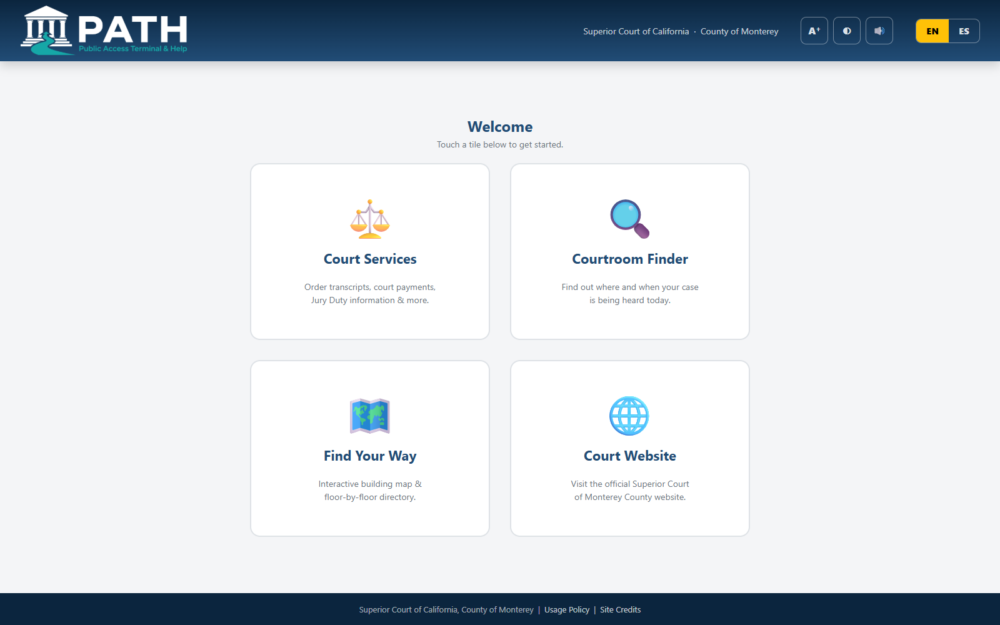
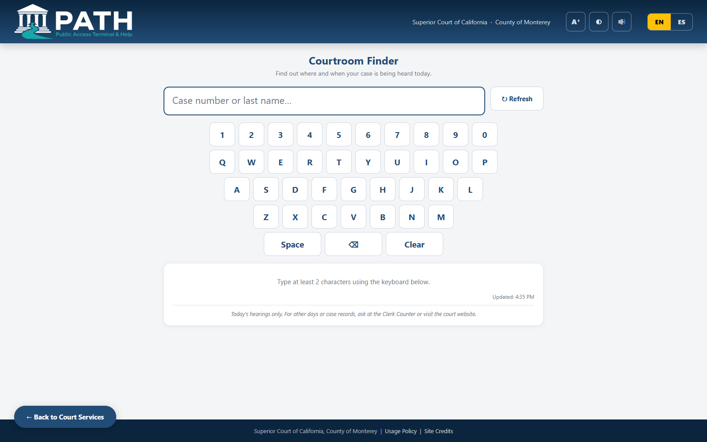
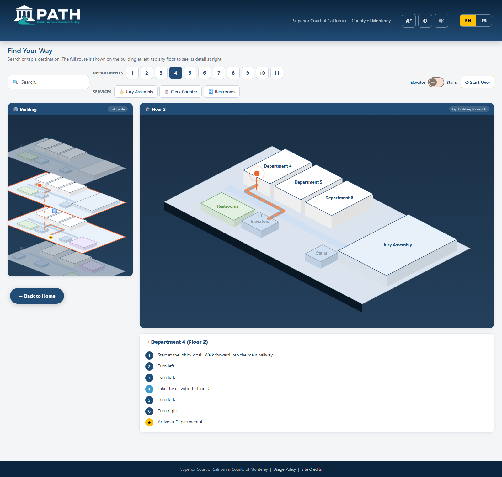

<p align="center">
  
</p>

# PATH — Public Access Terminal & Help

A public-facing, touchscreen kiosk web application for the Superior Court of California, County of Monterey. Visitors use it for self-service access to court services, department hearing calendars, and an interactive building map with turn-by-turn wayfinding.

Built with **Angular 21** (standalone components, signals, zoneless) + **Bootstrap 5** + **Angular Material** (M3) + **SweetAlert2**.

## Features

- **Fully bilingual (English / Spanish)** — one-tap EN/ES toggle in the navbar; every page, including SVG map labels and spoken audio, re-renders live. *(Spanish strings are drafts pending official court review.)*
- **Courtroom Finder (live)** — visitors type a case number or last name on an on-screen keyboard and see where and when their case is being heard *today*, straight from the court's calendar-boards API; each result offers "Show me the way," which opens the map with the route already drawn.
- **Interactive wayfinding** — an exploded isometric view of all four floors plus a per-floor detail view, with Dijkstra routing over a node graph, cross-floor routes via elevator or stairs, and turn-by-turn directions.
- **Court calendars** — per-department hearing schedules (currently seeded sample data; wire `CalendarBoardsService.courtroomBoard()` into `pages/calendar/calendar.ts` for live data).
- **Kiosk-safe services** — transactional services (payments, transcript orders) never open on the kiosk; they show an info page with an offline-generated QR code and a plain-text URL so visitors finish on their own phone.
- **Accessibility modes** — one-tap large text, high contrast, and audio assistance (Web Speech API self-voicing with spoken directions). Modes are per-visitor, never persisted, and reset on idle.
- **Idle reset** — after ~2 minutes of inactivity (with a "still there?" countdown), the kiosk returns home and clears accessibility modes for the next visitor.

## Screenshots

**Welcome screen** — four large touch tiles, with the language toggle and accessibility toolbar (large text · high contrast · audio) in the navbar:



**Courtroom Finder** — on-screen keyboard (kiosks have no physical one), live search of today's hearings by case number or last name, and a "Show me the way" hand-off into the map:



**Find Your Way** — exploded isometric view of all four floors (left) and the selected floor's detail (right); picking a destination draws the full route across floors with turn-by-turn directions:



## Development

```bash
npm install
cp proxy.conf.sample.json proxy.conf.json   # set the internal calendar API host (file is gitignored)
npm start        # ng serve on port 4300, binds 0.0.0.0
```

Routes: `/` · `/services` · `/service/:id` · `/courtroom-finder` · `/calendars` · `/calendar/:dept` · `/map`

### Calendar boards API (Courtroom Finder)

The Courtroom Finder page reads today's hearings from the court's internal calendar-boards API through
relative `/api/calendar/board/...` paths. In development the dev-server proxy (`proxy.conf.json`)
forwards those to the internal API host; in production the web server must reverse-proxy the same
paths — scoped to the **read-only board endpoints only**. The internal hostname is intentionally
never committed to this repository. If the API is unreachable the page degrades to a bilingual
"temporarily unavailable" notice.

## Production build & deployment

```bash
npx ng build     # output in dist/path-kiosk/browser
```

Deploy the build output to any static web server. Because this is an SPA with client-side routing, the server needs a fallback rewrite rule sending all paths to `index.html` (on IIS: URL Rewrite module; on nginx: `try_files $uri /index.html;`).

For kiosk hardware, pair with a locked-down browser (e.g. Chromium `--kiosk` mode or a dedicated kiosk browser with a URL allowlist).

## Project layout

```
src/app/
├── core/               # I18nService, IdleService, AccessibilityService
├── shared/             # navbar (lang + accessibility toolbars), footer
└── pages/
    ├── home/           # 4 kiosk tiles
    ├── services/       # service cards (external, in-app, QR info page, or coming soon)
    ├── service-info/   # QR + URL page for use-your-phone services
    ├── case-lookup/    # Courtroom Finder: today's hearings search (calendar boards API + on-screen keyboard)
    ├── calendars/      # department picker
    ├── calendar/       # per-department schedule (seeded sample data)
    └── map/            # wayfinding: wayfinding.ts (graph + Dijkstra), map.ts (isometric SVG)
```
